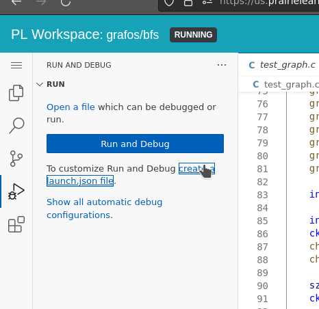
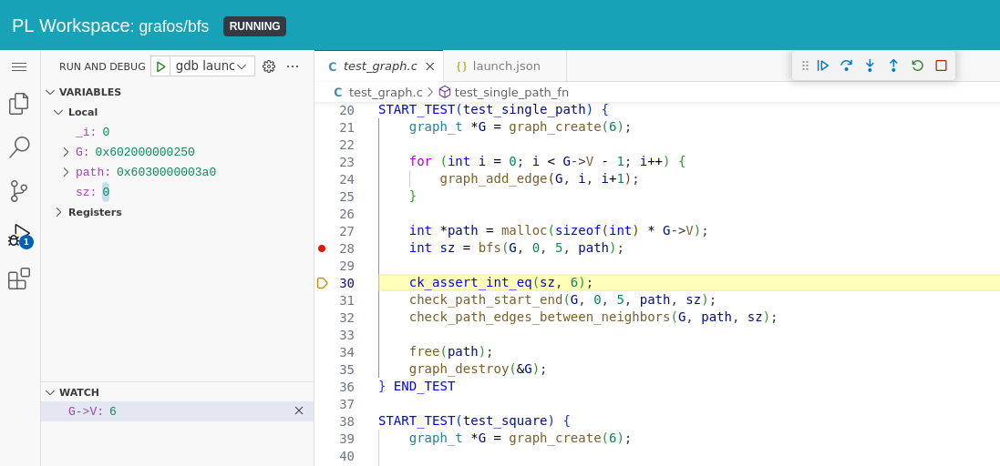

# Debug C no VSCode

Assim como em Python e Java, precisamos de uma extensão para debugar código C no VSCode. Workspaces do PrairieLearn tem a extensão [Eclipse CDT](https://open-vsx.org/extension/eclipse-cdt/cdt-gdb-vscode) instalada a partir de 12/09 e podemos usá-la para debugar programas em C linha a linha como já fizemos nos últimos semestre. 

!!! warning 
    Para que as confiruações feitas nesse guia sejam salvas com os seus arquivos, é recomendado que vocês abram a pasta `mygraph` usando o comando abaixo.

    

A configuração dessa extensão é via um arquivo `launch.json` dentro da pasta `.vscode` do projeto de vocês. Um arquivo deste tipo é criado ao selecionar a opção abaixo.



Selecione *GDB* na caixa de seleção que aparecer. Delete o conteúdo padrão do arquivo e cole o seguinte.

```json
{
    "version": "0.2.0",
    "configurations": [
        {
            "type": "gdb",
            "request": "launch",
            "name": "gdb launch",
            "program": "${workspaceFolder}/a.out", // edite para o caminho do executável desejado
            "initCommands": [
                "set environment CK_FORK no"
            ]
        }
    ]
}
```

Agora você deve ter o debug ativado e pode usá-lo para encontrar erros nos programas de vocês :)



!!! warning
    Não se esqueçam de compilar o programa com as flags `-O0 -g` para ter acesso a todas as variáveis ao debugar. A linha de comando completa ficaria assim:

    <ah-terminal>
    gcc -Wall -O0 -g lista de arquivos.c  \`pkg-config --cflags --libs check\`
    </ah-terminal>
