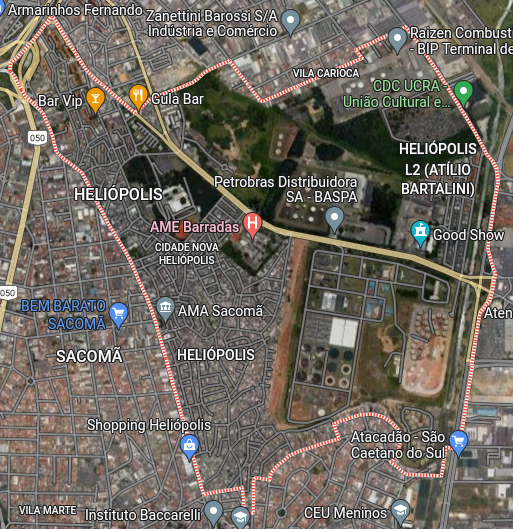
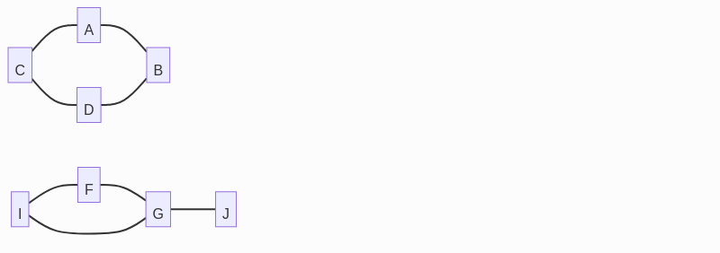

# Grafos e Árvores

## Introdução a grafos

--------

---------

# Enchentes em Heliópolis

- Alguma área está isolada do resto da comunidade?
- Como sair de sua casa até um destino?
- Qual o mínimo de intervenções necessárias para que todos pontos isolados sejam restaurados?

------

# Como representar esse mapa?

-----

-----

# Grafo

- $V = {1 \dots N}$ - conjunto de vértices
- $E = { (x, y) | x, y \in V; x \neq y}$ 
    - conjunto de arestas (*edges*)
    - sai de $x$ e chega em $y$

-----

# E o mapa?

##  Alguma área está isolada do resto da comunidade?

1. o que cada vértice do grafo representa?
2. qual relação  entre vértices uma aresta representa?
3. essa relação tem direção ou é sempre simétrica?
4. essa relação tem pesos/preferências ou todas arestas são equivalentes?

----

# Tipos de grafos

1. simetria:
    - não direcionado: associações são sempre bi-direcionais (${i,j} \in E \Leftrightarrow {j,i} \in E$)
    - direcionado: associações podem ou não ser bi-direcionais
2. pesos:
    - arestas são todas equivalente
    - cada aresta tem um número real associado a ela

Em alguns problema específicos podem ser permitidos loops (${i, i} \in E$) ou mais de uma aresta por par de vértices. Isso **não deve ocorrer nos problemas desta disciplina**.

----

# Outros exemplos

- dependência entre partes de produção
- traçar caminhos em um mapa
- conectar cidades com mínimo de ligações
- criação de agrupamentos ou equipes

------------

# Representação computacional

**Representação formal**:
- $V = {1 \dots N}$
- $E = { (x, y) | x, y \in V; x \neq y}$ 

Como transformar em uma representação **computacional** eficiente?

----

# Representação computacional

- $V$ pode ser representado só pelos números mesmo. Só preciso guardar $|V| = N_v$
- $E$ pode ser representado como uma matriz $A$ quadrada com $N_v$ linhas e colunas

$$
A_{i,j} = \begin{cases}
1 \text{ se } {i,j} \in E \\
0 \text{ caso contrário }
\end{cases}
$$

----

# Representação computacional

- quantas arestas **chegam** no vértice $i$?
- quantas arestas **saem** no vértice $i$?
- como é a matriz se o grafo for **não direcionado**?
- e se tiver pesos?

